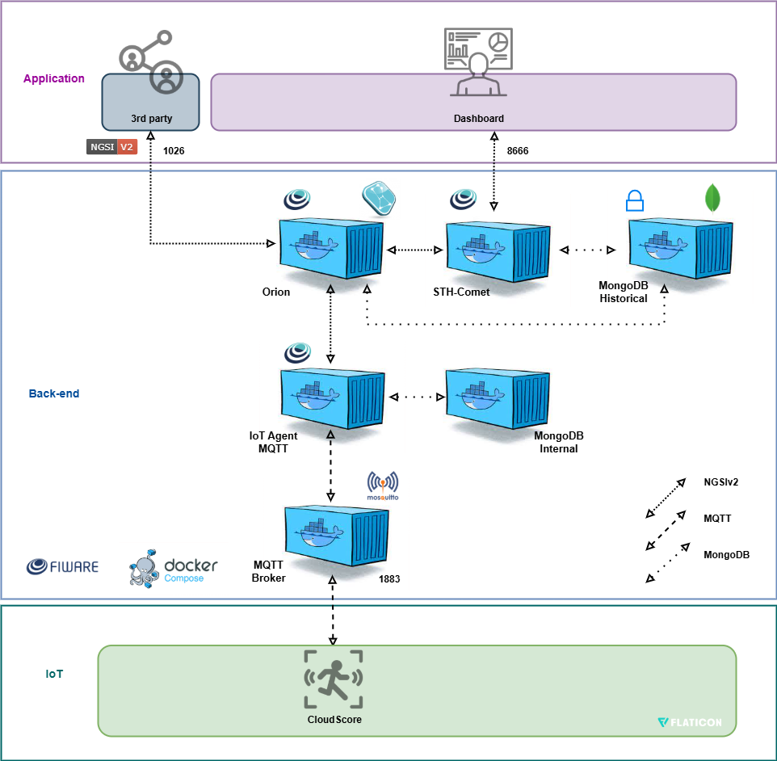

# CloudScore - Placar e Engajamento da Torcida em Tempo Real
---
## Autores
- Antônio Jacinto de Andrade Neto (RM: 561777)
- Felipe Bicaletto (RM: 563524)
- João Vitor dos Santos Pereira (RM: 551695)
- Thayná Pereira Simões (RM: 566456)
---
## Descrição do projeto
CloudScore é um sistema que integra o placar eletrônico de jogos com métricas de engajamento da torcida, enviando todos os dados para a nuvem em tempo real. O projeto permite monitorar os pontos de cada time e a participação da torcida de maneira centralizada e acessível.

O dashboard web, desenvolvido em Flask, Tailwind CSS e Chart.js, exibe o placar e gráficos de engajamento de forma responsiva, garantindo que as informações estejam sempre atualizadas sem necessidade de recarregar a página. Os dados podem ser visualizados em qualquer dispositivo, do desktop ao celular.

---
## Arquitetura do projeto


### O sistema é composto por três camadas principais:
1. **Dispositivo IoT (ESP32)** 
 - Lê sensores sonoros de ambas as torcidas
 - Controla o placar
 - Publica os valores no **broker MQTT** em tópicos específicos.  

2. **Broker MQTT**  
   - Recebe os dados do ESP32 e distribui para os consumidores (ex.: FIWARE IoT Agent).  
   - IP configurável (ex.: `20.118.201.114`).

3. **FIWARE / STH-Comet / Dashboards**  
   - O **FIWARE IoT Agent** consome os dados do MQTT e os armazena no **STH-Comet**
   - Um dashboard em **Python Flask** conecta-se ao STH e exibe:  
     - Placar em tempo real
     - Gráfico de engajamento

---

## Como funciona
- ESP32 controla o placar do jogo (por meio de quatro botões, que servem para adicionar e retirar pontos dos times) e coleta dados de som de ambas as torcidas (sensor sonoro simulado usando potenciometros) e exibe tudo em um **display LCD**
- MQTT distribui os dados para o FIWARE IoT Agent, que registra os valores históricos.
- Dashboard em Flask consulta o STH-Comet para exibir o gráfico de engajamento e o placar.
Link da Simulação Wokwi: 

---
## Manual de instalaçõ em uma VM (Ubuntu Server)
### 1️. Pré-requisitos
- Ubuntu Server LTS (20.04 ou 22.04)
- Python 3.12 (ou superior)
- Pip instalado
- Porta 5000 liberada no firewall

### 2️. Clonar o projeto e subir docker
```sh
git clone https://github.com/Grupo-FIAP-Antonio-Felipe-e-Joao-Vitor/sprint4-Edge.git
cd sprint4-Edge
```

### 3. Atualize os pacotes do sistema:
```sh
sudo apt update
```

### 4. Instale o Docker e o Docker Compose:
```sh
sudo apt install docker.io
sudo apt install docker-compose
```

### 5. Suba os containers necessários para o FIWARE Descomplicado:
```sh
sudo docker-compose up -d
```

---
## Instalação e configuração do dispositivo

1. Baixe a collection do Postman disponível na pasta **docs** do repositório no GitHub.

2. Crie uma variável de ambiente chamada url e passe o IP da sua vm criada.

3. Siga os passos:
- Execute o Health Check do **Iot-Agent**, **STH-Comet** e **Orion**.
- No **Iot-Agent** provisione o Service Group e provisione o Smart Device.
- No **STH-Comet** realize o Subscribe Device
- No ESP32:
     - Altere o **SSID** para o nome da rede Wifi
     - Altere o **PASSWORD** para a senha da rede Wifi
     - Altere o **BROKER_MQTT** para o IP da sua vm

4. Visualizar dados de forma manual
- No **Iot-Agent**:
     - Execute o **Result of score A** para visualizar os pontos do time A
     - Execute o **Result of score B** para visualizar os pontos do time B
     - Execute o **Result of engajamento A** para visualizar o último valor de engajamento do time A
     - Execute o **Result of engajamento B** para visualizar o último valor de engajamento do time B

- No **STH-Comet**:
     - Execute o **Request Engajamento A** para visualizar os últimos 30 valores de engajamento do time A
     - Execute o **Request Engajamento B** para visualizar os últimos 30 valores de engajamento do time B

---

## Instalação e configuração do dashboard
